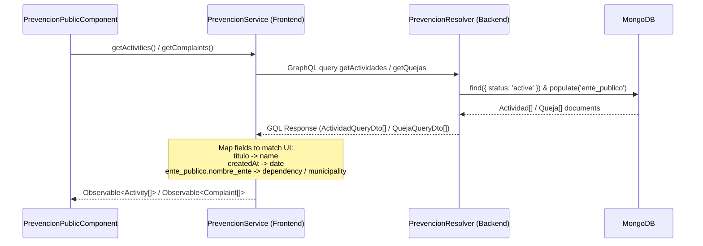
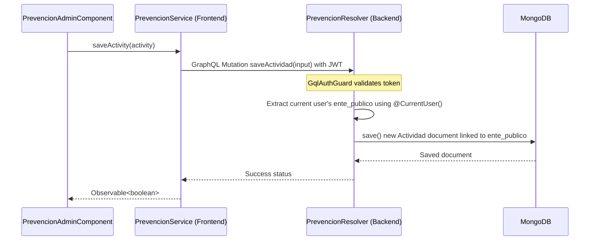

# Design: Prevention Backend Integration

## Technical Approach
We will build a new NestJS backend module `prevencion` that exposes GraphQL queries and mutations to retrieve and record prevention activities and complaints. We will secure these mutations with `GqlAuthGuard` and populate the `ente_publico` association automatically using the authenticated user's context (`@CurrentUser()`).
On the frontend, we will integrate `Apollo-Angular` into `PrevencionService` to replace the existing hardcoded mock arrays with real GraphQL operations. Data transformation logic will map backend fields (such as `titulo` and `ente_publico.nombre_ente`) to the frontend's expected format.

---

## Database Schema Structure

### 1. Actividad Schema
Stored in MongoDB via Mongoose.
```typescript
import { Schema } from 'mongoose';

export const ActividadSchema = new Schema({
  titulo: {
    type: String,
    required: true,
  },
  descripcion: {
    type: String,
    required: false,
    default: '',
  },
  evidencias: [{
    titulo: { type: String, required: true },
    archivo: { type: String, required: true }, // URL or Base64 string representing the file
  }],
  ente_publico: {
    type: Schema.Types.ObjectId,
    ref: 'EntePublico',
    required: true,
  },
  status: {
    type: String,
    default: 'active',
  }
}, {
  timestamps: true, // Automatically manages createdAt and updatedAt
});
```

### 2. Queja Schema
Stored in MongoDB via Mongoose.
```typescript
import { Schema } from 'mongoose';

export const QuejaSchema = new Schema({
  procedentes: {
    type: Number,
    required: true,
    min: 0,
  },
  improcedentes: {
    type: Number,
    required: true,
    min: 0,
    default: 0,
  },
  ente_publico: {
    type: Schema.Types.ObjectId,
    ref: 'EntePublico',
    required: true,
  },
  status: {
    type: String,
    default: 'active',
  }
}, {
  timestamps: true, // Automatically manages createdAt and updatedAt
});
```

---

## GraphQL Schema (DTOs & Inputs)

### 1. Actividad DTOs and Inputs
```typescript
@InputType()
export class EvidenceInput {
  @Field()
  readonly titulo: string;

  @Field()
  readonly archivo: string;
}

@InputType()
export class ActividadRegisterInput {
  @Field()
  readonly titulo: string;

  @Field()
  readonly descripcion?: string;

  @Field(() => [EvidenceInput], { nullable: true })
  readonly evidencias?: EvidenceInput[];
}

@ObjectType()
export class EvidenceDto {
  @Field()
  readonly titulo: string;

  @Field()
  readonly archivo: string;
}

@ObjectType()
export class ActividadQueryDto {
  @Field(() => ID)
  readonly id: string;

  @Field()
  readonly titulo: string;

  @Field()
  readonly descripcion: string;

  @Field(() => [EvidenceDto])
  readonly evidencias: EvidenceDto[];

  @Field(() => EnteQueryDto)
  readonly ente_publico: EnteQueryDto;

  @Field()
  readonly createdAt: Date;

  @Field()
  readonly updatedAt: Date;

  @Field()
  readonly status: string;
}
```

### 2. Queja DTOs and Inputs
```typescript
@InputType()
export class QuejaRegisterInput {
  @Field()
  readonly procedentes: number;

  @Field({ defaultValue: 0 })
  readonly improcedentes: number;
}

@ObjectType()
export class QuejaQueryDto {
  @Field(() => ID)
  readonly id: string;

  @Field()
  readonly procedentes: number;

  @Field()
  readonly improcedentes: number;

  @Field(() => EnteQueryDto)
  readonly ente_publico: EnteQueryDto;

  @Field()
  readonly createdAt: Date;

  @Field()
  readonly updatedAt: Date;

  @Field()
  readonly status: string;
}
```

---

## Sequence Flows

### 1. Fetching Prevention Data (Public view)


### 2. Saving an Activity (Admin view)


---

## File Changes

| File | Action | Description |
|---|---|---|
| `backend/src/prevencion/` | Create | New NestJS module folder including Resolver, Service, Modules, Schemas, DTOs, and Inputs. |
| `backend/src/app.module.ts` | Modify | Import and register `PrevencionModule`. |
| `frontend/src/app/prevencion/services/prevencion.service.ts` | Modify | Replace local arrays and mocks with Apollo GraphQL queries and mutations. |

---

## Testing Strategy
- **Backend**:
  - Unit tests for `PrevencionResolver` and `PrevencionService` using mock Mongoose model and mock `CurrentUser` context.
- **Frontend**:
  - Unit tests for `PrevencionService` using `ApolloTestingController` to verify request construction, endpoint URLs, and response mapping.
